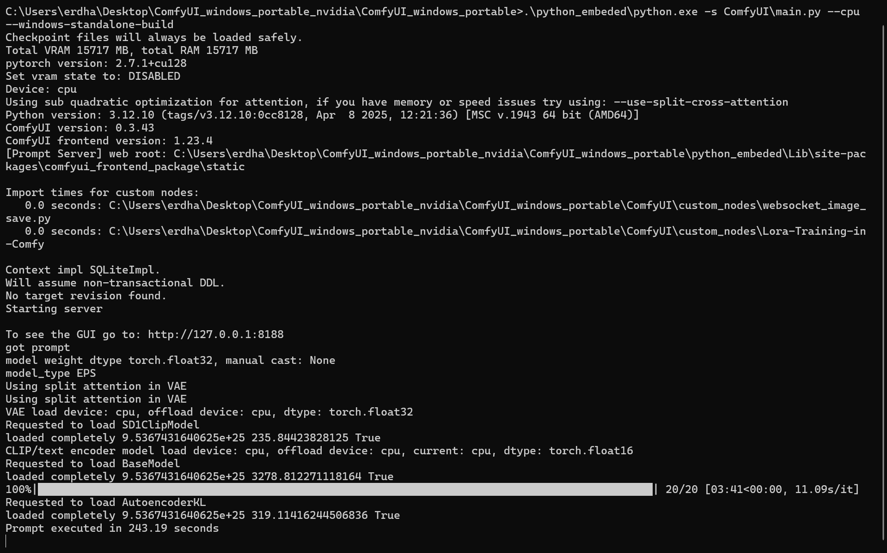
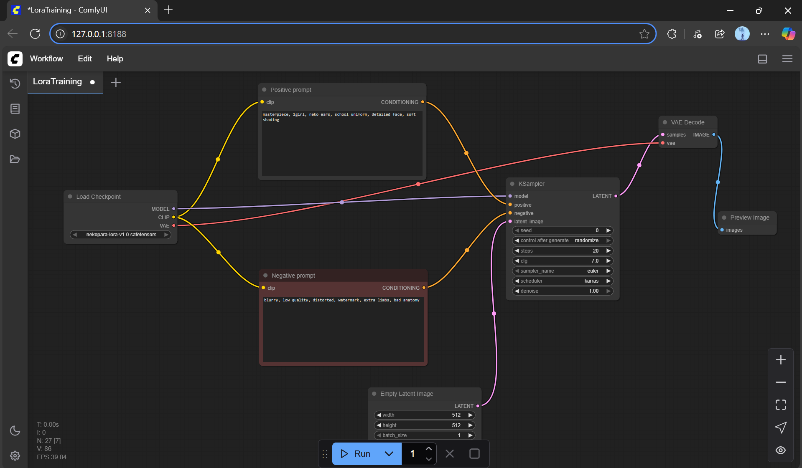
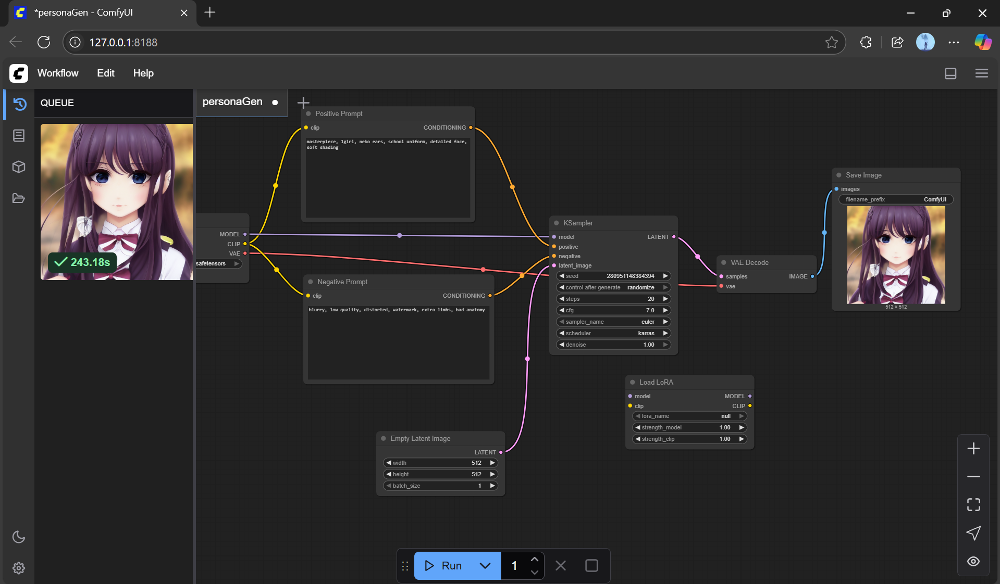
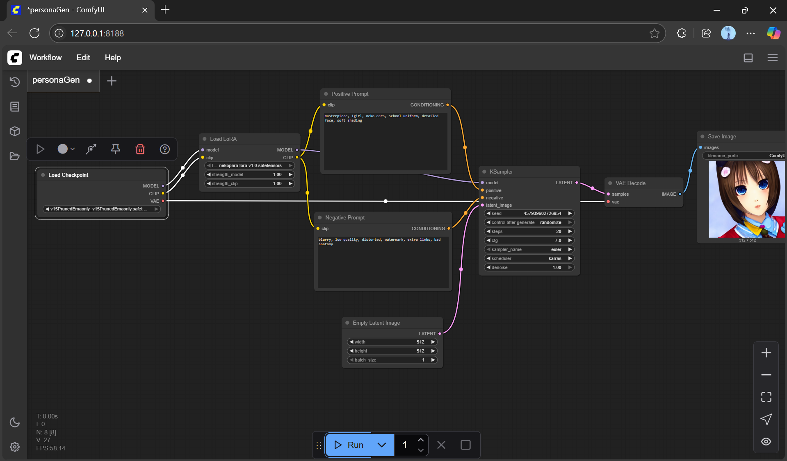

# PersonaGen: AI-Powered Visual Identity Generator (ComfyUI + LoRA)

**PersonaGen** is a Generative AI project built using **ComfyUI** that enables stylized image generation powered by LoRA (Low-Rank Adaptation) models. The system is designed to create character-based visual outputs based on text prompts with style transfer features.

---

## Features

- Text-to-Image generation with Stable Diffusion
- LoRA-based stylistic enhancement (e.g., anime, cubism)
- Full CPU-compatible setup (no GPU required)
- Output preview and structured saving
- Easily modifiable prompt and sampling settings

---

##  Workflow Components

- **Checkpoint Model**: `v1-5-pruned-emaonly.safetensors`
- **LoRA Model**: `nekopara-lora-v1.0.safetensors`
- **Positive Prompt**: `masterpiece, 1girl, neko ears, school uniform, detailed face, soft shading`
- **Negative Prompt**: `blurry, low quality, distorted, watermark, extra limbs, bad anatomy`
- **Sampler**: Euler/Karras with adjustable steps and denoising

---

## Current Progress
- Workflow experiments ongoing

### Terminal Execution (ComfyUI Startup)

### Output Folder Structure

### Sample Generated Image 1

### Sample Generated Image 2

